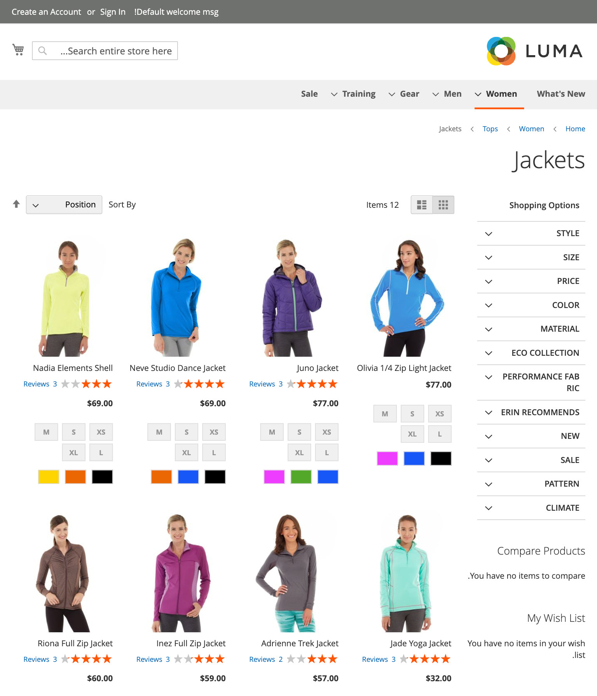

# About

Magento 2 Luma theme RTL.

Can be used as a parent for themes that use Hebrew, Arabic, and other RTL script languages.

Based on [Blank RTL](https://github.com/acid-unit/theme-blank-rtl/) theme `v100.4.7-p1-0`, which, in turn,
is based on Magento 2 original Blank theme `v100.4.7-p1` (built-in to Magento `v2.4.7-p1`)

It was not tested on the previous Magento versions, but as long as it is Magento 2.4.X,
the theme should work perfectly fine (though there is a chance some styles will be off)

In general, that is an exact copy of Blank theme, but with added `direction: rtl;` rule
for `<body>` tag, `dir="rtl"` attribute for `<html>` tag, and left/right styles swapped.

# Preview

# Examples of CSS updates:

| Original Luma                                                         | Luma RTL                                                            |
|-----------------------------------------------------------------------|---------------------------------------------------------------------|
| `right: 0;`                                                           | `left: 0;`                                                          |
| `margin-right: -155px;`                                               | `margin-left: -155px;`                                              |
| `float: left;`                                                        | `float: right;`                                                     |
| `text-align: left;`                                                   | `text-align: right;`                                                |
| `margin: 0 0 0 85px;`                                                 | `margin: 0 85px 0 0;`                                               |
| `box-shadow: 3px 6px 4px 0 rgba(0, 0, 0, .3);`                        | `box-shadow: -3px 6px 4px 0 rgba(0, 0, 0, .3);`                     |
| `border-right: 1px solid #000;`                                       | `border-left: 1px solid #000;`                                      |
| `border-bottom-left-radius: 0;`                                       | `border-bottom-right-radius: 0;`                                    |
| `border-radius: 2px 0 0 2px;`                                         | `border-radius: 0 2px 2px 0;`                                       |
| `transition: right 1s;`                                               | `transition: left 1s;`                                              |
| `background: #fff url('../images/select-bg.svg') no-repeat 100% 45%;` | `background: #fff url('../images/select-bg.svg') no-repeat 0% 45%;` |

# Installation

`composer require acid-unit/theme-frontend-luma-rtl`

# Usage

To preview the theme, use `Magento Luma RTL (Acid Unit)` theme for Store View under
`Content > Design > Configuration > Applied Theme` admin section.

(because Luma RTL is based on Blank RTL theme, in the theme list you will notice both themes for selection)

To use theme as a parent, use `<parent>AcidUnit/luma-rtl</parent>` in your `theme.xml` file.

# Note

The theme is based on [Blank RTL](https://github.com/acid-unit/theme-blank-rtl/) theme, not on Magento's original Luma theme,
so in order to be identical to Magento's Luma theme in all ways, it contains all the style, layout, template and other files
that original Luma theme has.

According to that, Luma RTL has `.less` files that are identical to the original Luma theme files, because there are no CSS rules to be RTL-modified.

These files have a `// @no_changes` comment at the top.
If the file does not have this comment, that means it has at least a single CSS rule updated.

# Additional

- `@icon-prev` and `@icon-next` icon variables values are swapped too
- All modified CSS rules are marked with the `// @rtl` comment
- `// @keep-old` comments mark CSS rules, values of which were not changed, though they fall under the general update
  rule
